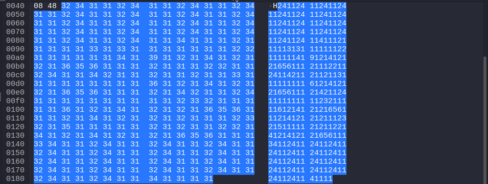

# Back to Basics: Socket Experimentations

## Goal

The main goal of this project was to experiment with socket programming to transfer files using a custom binary encoding between a server and a client.

## Received Result

After the transfer, the result can be viewed in the image below, showcasing the successful reception of the file:

## Appearance on Wireshark

While experimenting, the data packets were captured using Wireshark, giving a visual representation of the transfer process. Here’s an example of what the transmission looked like:

## Advanced Techniques: Hidden Transfers

For more stealthy or "hidden" transfers, consider transferring data one byte at a time. You can use tools like `ping` to send the data in small chunks, introducing a small delay (`sleep`) between transmissions or using a counter to send the data in intervals.

To avoid detection , it may be a good idea to obfuscate most of the code , mainly the socket part. Very suspicious.

These methods can help avoid detection or help in situations where bandwidth is limited or needs to be masked.

## Requirements

To run this project:

- Compile it yourself.

## Usage

1. Start the server on the designated machine.
2. Run the client on the other machine to initiate the file transfer.

## TODO

- Obfuscate the filename
- Parse the whole system to exfiltrate different files.
- change the buffer size to use malloc instead.
- Add error checking ?
- other things

